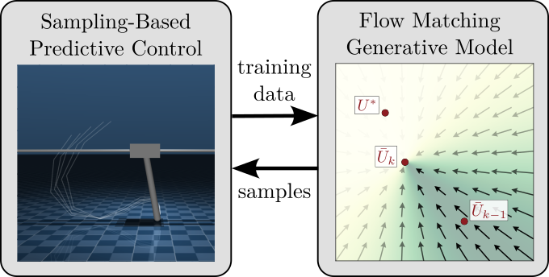

# Generative Predictive Control

This repository contains code for the paper "Generative Predictive Control: Flow
Matching Policies for Dynamic and Difficult-to-Demonstrate Task" by Vince Kurtz
and Joel Burdick.

Generative Predictive Control (GPC) is a supervised learning framework for
training flow-matching policies on tasks that are difficult to demonstrate but
easy to simulate. GPC alternates between generating training data with
[sampling-based predictive control](https://github.com/vincekurtz/hydrax),
fitting a generative model to the data, and using the generative model to
improve the sampling distribution.



## Install (Conda)

Clone and create the conda env (first time only):
```bash
git clone https://github.com/vincekurtz/gpc.git
cd gpc
conda env create -f environment.yml
```

Enter the conda env:

```bash
conda activate gpc
```

Install the package and dependencies:

```bash
pip install -e .
```

## Usage

Various examples can be found in the [`examples`](examples) directory. For
example, to train a cart-pole swingup policy using GPC, run:

```bash
python examples/cart_pole.py train
```

This will train a flow-matching policy and save it to
`/tmp/cart_pole_policy.pkl`. To run an interactive simulation with the trained
policy, run

```bash
python examples/cart_pole.py test
```

To see other command-line options, run

```bash
python examples/cart_pole.py --help
```
